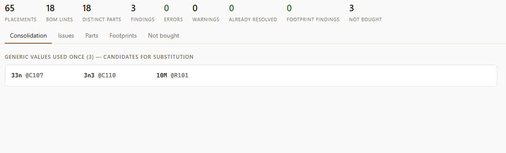
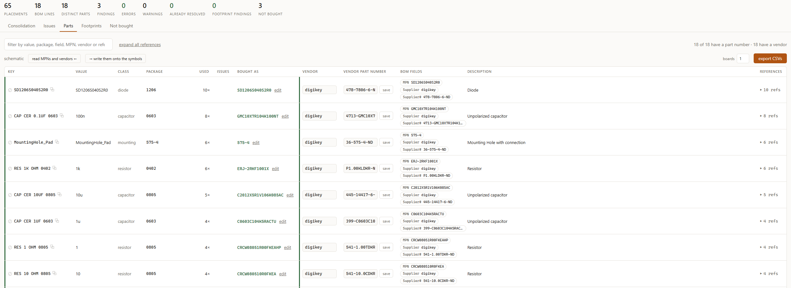
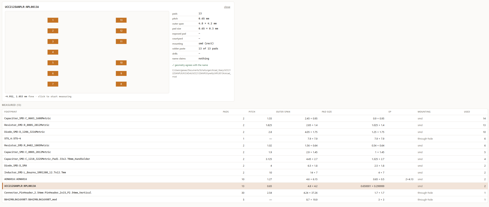

# kinv — KiCad BOM → consolidated inventory → a basket per supplier

## The problem

Your KiCad project is finished: the schematic is done, the PCB is routed, everything is reviewed, and
now you have to order the board and the parts. The board is easy — upload it to a manufacturer and
you are done. The parts are another story, and they can take hours: checking that every resistor
has the right size, that every 10 kΩ is spelled `10k` and not `10K`, `10kOhm` or `10 k`, and that all
10 kΩ resistors use the same package. Then you have to find each part at a vendor and write the
order list by hand. And then come the last-minute changes…

kinv makes this easy. It reads the information it needs straight out of your KiCad project, checks
it for inconsistent spellings, values and packages, and helps you turn the board into an order list
for your vendor.

kinv never changes your board on its own. Everything it finds is a suggestion, and every change is
something you confirm.

## Step 1 — Consolidation

The **Consolidation** tab collects suggestions for making your parts list shorter and more
consistent: the same value spelled in different ways, the same value in different packages, values
so close together that having both is probably an accident, and generic values that are used only
once. They are suggestions — you can ignore any of them, or mark one as settled so it stops showing
up.


_The Consolidation tab. Here kinv found three generic values that are each used only once — 33n,
3n3 and 10M. Each is a candidate for replacing with a value the board already uses, or it may be
exactly what the circuit needs._

## The Issues tab

The **Issues** tab lists problems in the schematic as soon as they appear — for example a part with
no footprint, a value that cannot be read, or a resistor placed on a capacitor footprint.

## Step 2 — Parts

Once the consolidation is done, move on to the **Parts** tab. It shows every part on the board
together with all the information your schematic holds about it, so missing or forgotten details
are easy to spot.


_The Parts tab. Each row is one part, named the way a distributor lists it (for example
`CAP CER 0.1UF 0603`); the copy button next to the name puts it on the clipboard for a vendor search._

Here you assign the real part to every generic resistor, capacitor and other part: type the
manufacturer part number (MPN) in **bought as**, then add the **vendor** and the **vendor part
number**.

Press **→ write them onto the symbols** to store the MPN, manufacturer, vendor and vendor part
number on the symbols in your schematic. The next time you copy that part, the information travels
with it and you do not have to look it up again. **read MPNs and vendors ←** does the opposite: it
reads that information back from the schematic. Both buttons show you what will change before they
change anything.

When every part has a vendor, set the number of **boards** and press **export CSVs**. kinv asks where
to save the files and writes one upload file per vendor, containing the quantity and the vendor part
number. Before you place the order, though, finish step 3.

## Step 3 — Footprint check

The **Footprints** tab lists every footprint used on the board with its measured pad count, pitch,
size and mounting type. Click a footprint to see it drawn and to measure between pads, so you can
cross-check it against the datasheet.


_The Footprints tab, measuring a footprint from a custom library._

Once you are sure the parts list is correct, go back to the **Parts** tab, export the CSV files and
finish your order.

## Not bought

The **Not bought** tab lists the parts that are left out of the order: board features without a
physical part, such as mounting holes and test pads, and any part you removed with the **⊘** (do not
buy) button in the Parts tab — for example parts you already have in stock. The **buy this ↑** button
puts a part back on the list.

## Running kinv

kinv is written in Python and uses only the standard library, so there is nothing to install. It runs
on any Python 3.11 or newer — including the Python that ships with KiCad.

Download or clone this repository, open a terminal in its folder, and start kinv with your project:

```powershell
# with your own Python
python -m kinv ui "C:\path\to\your\project.kicad_pro"

# with the Python that ships with KiCad (PowerShell needs the & in front of a quoted path)
& "C:\Program Files\KiCad\10.0\bin\python.exe" -m kinv ui "C:\path\to\your\project.kicad_pro"
```

kinv opens in your browser. It re-reads the schematic every time you save in KiCad, so you can keep
both open side by side. Press **Ctrl+C** in the terminal to stop it.

Useful to know:

- **Requirements:** KiCad 9 or 10. kinv uses `kicad-cli`, which comes with KiCad, to read the
  schematic. It also accepts a BOM exported as `.csv`.
- **Your decisions are stored in plain files.** The parts you assign (MPN, manufacturer, vendor) are
  kept in `.kinv` in your user folder and shared by all your projects, so a part you chose once is
  already known on the next board. Per-project decisions — settled suggestions and do-not-buy parts —
  are kept in a `.kinv` folder next to the project, where they can be committed to git.
- **Closing the schematic editor** is required before writing onto the symbols; kinv will not change
  a file that KiCad has open.

## Not planned

kinv will not connect to any vendor website. It does not look up prices, stock or part numbers — you
decide which part to buy and where, and kinv keeps track of it.

## Development

How kinv was designed and built, including the decisions behind it, is documented in
[build_log.md](build_log.md).
